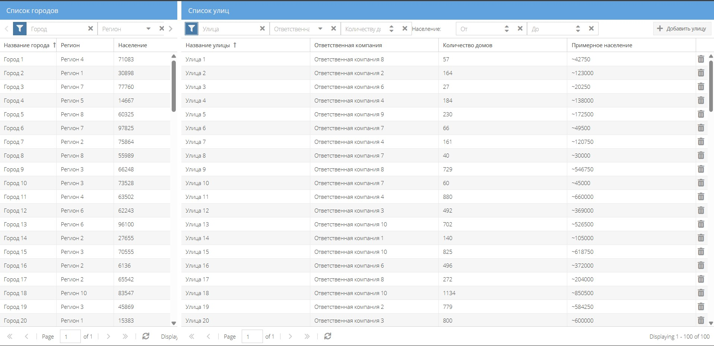

# AITI Guru



# Инструкция по сборке и запуску проекта

## Установка зависимостей

Для начала необходимо добавить фреймворк ExtJS в проект.

[📌] Для запуска и сборки проекта требуется SDC ExtJS! Проект разрабатывался на ExtJS 7.4.0

Выполните следующую команду:

```bash
npm run init
```

Команда запустит установку фреймворка из указанного пути:

```bash
sencha framework add --source C:\\SDC\\ext-7.4.0 --path ext
```

## Запуск проекта

Для запуска проекта в режиме разработки выполните команду:

```bash
npm run start
```

Это автоматически запустит команду:

```bash
cd ./App && sencha app watch --j2ee -port 1841
```

## Сборка проекта

Для сборки проекта в продакшн выполните команду:

```bash
npm run build
```

Эта команда выполнит:

```bash
cd ./App && sencha app build production
```

## Работа с ИИ в проекте
1)  - GPT-5 
    - Решение ошибок "production" сборки
    - Проработка логики построения проекта, разработка плана работ
2)  - Claude
    - Подготовка шаблона компонента по описанию для дальнейшего использования в проекте
    - Поиск оптимального решения 
